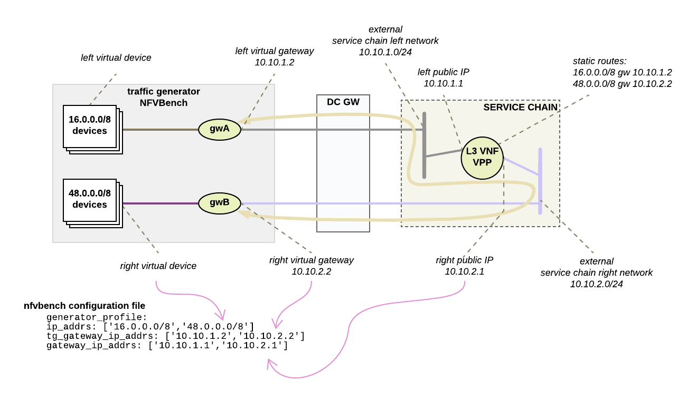

# L3 NFVBench and VPP
This set of scripts and documentation helps about brining up an environment for L3 traffic profiles using NFVBench and VPP.

The L3 traffic profile is here rappresented


## Environment Preparation
First off create the environment using [create.sh](create.sh)

## NFVBench and VPP
Then follow [run_nfvbench](run_nfvbench.md) and [run_vpp](run_vpp.md)

## Testing with OVS Stateful Conntrack (Firewall)
There are a few simple steps:
- Enable Neutron Port Security
- Enable Neutron Security Group (with correct ports)
- Allow Address Pair (with correct clients addresses)
```
source ~/overcloudrc
openstack security group create reflector
openstack security group rule list reflector --column ID --format value | xargs -n1 openstack security group rule delete
openstack security group rule create --ingress --protocol udp --dst-port 1234 reflector
openstack security group rule create --ingress --protocol udp --dst-port 4321 reflector
openstack security group rule create --egress --protocol udp --dst-port 1234 reflector
openstack security group rule create --egress --protocol udp --dst-port 4321 reflector
openstack port set --enable-port-security --security-group reflector --allowed-address ip-address=16.0.0.0/8 reflector_b
openstack port set --enable-port-security --security-group reflector --allowed-address ip-address=48.0.0.0/8 reflector_a
```

To re-disable the OVS Conntrack:
```
source ~/overcloudrc
openstack port set --disable-port-security --no-security-group --no-allowed-address reflector_b
openstack port set --disable-port-security --no-security-group --no-allowed-address reflector_a
```

Be adviced that the NFVBench config here provided will generate 1 million flows that results in 2M conntrack entries:
```
ovs-appctl dpctl/dump-conntrack|wc -l
2000000
ovs-appctl dpctl/dump-conntrack|tail -4
udp,orig=(src=16.0.0.0,dst=48.4.131.27,sport=1234,dport=4321),reply=(src=48.4.131.27,dst=16.0.0.0,sport=4321,dport=1234),zone=6
udp,orig=(src=16.0.0.0,dst=48.3.219.134,sport=1234,dport=4321),reply=(src=48.3.219.134,dst=16.0.0.0,sport=4321,dport=1234),zone=6
udp,orig=(src=16.0.0.0,dst=48.0.131.56,sport=1234,dport=4321),reply=(src=48.0.131.56,dst=16.0.0.0,sport=4321,dport=1234),zone=6
udp,orig=(src=16.0.0.0,dst=48.3.208.104,sport=1234,dport=4321),reply=(src=48.3.208.104,dst=16.0.0.0,sport=4321,dport=1234),zone=4
```

Play with ```ip_addrs``` and ```flow_count``` to reduce the number of flows to something a bit more normal (here using /30 and 4 flows)
```
ovs-appctl dpctl/dump-conntrack
udp,orig=(src=48.0.0.0,dst=16.0.0.0,sport=1234,dport=4321),reply=(src=16.0.0.0,dst=48.0.0.0,sport=4321,dport=1234),zone=4
udp,orig=(src=48.0.0.0,dst=16.0.0.1,sport=1234,dport=4321),reply=(src=16.0.0.1,dst=48.0.0.0,sport=4321,dport=1234),zone=4
udp,orig=(src=16.0.0.0,dst=48.0.0.0,sport=1234,dport=4321),reply=(src=48.0.0.0,dst=16.0.0.0,sport=4321,dport=1234),zone=6
udp,orig=(src=16.0.0.0,dst=48.0.0.1,sport=1234,dport=4321),reply=(src=48.0.0.1,dst=16.0.0.0,sport=4321,dport=1234),zone=6
udp,orig=(src=48.0.0.0,dst=16.0.0.0,sport=1234,dport=4321),reply=(src=16.0.0.0,dst=48.0.0.0,sport=4321,dport=1234),zone=6
udp,orig=(src=16.0.0.0,dst=48.0.0.0,sport=1234,dport=4321),reply=(src=48.0.0.0,dst=16.0.0.0,sport=4321,dport=1234),zone=4
udp,orig=(src=16.0.0.0,dst=48.0.0.1,sport=1234,dport=4321),reply=(src=48.0.0.1,dst=16.0.0.0,sport=4321,dport=1234),zone=4
udp,orig=(src=48.0.0.0,dst=16.0.0.1,sport=1234,dport=4321),reply=(src=16.0.0.1,dst=48.0.0.0,sport=4321,dport=1234),zone=6
```

# Useful links
- [OVS Conntrack Tutorial](http://docs.openvswitch.org/en/latest/tutorials/ovs-conntrack/)
- [OVS readable stats](https://github.com/m4r1k/ovs_stats/)
